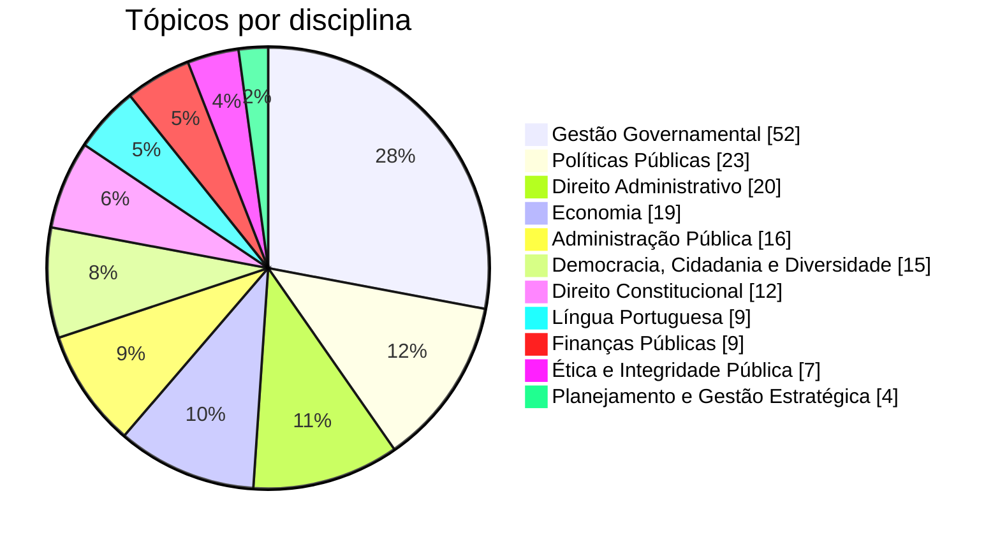

<div align="center">

# 📚 EPPGG Bahia 2026

### O conteúdo programático do edital, organizado e explicado

Uma página única que transforma o Anexo I do edital em um guia de estudo navegável:<br>
186 tópicos, 11 disciplinas, uma explicação curta para cada item.


</div>

---

## Por que este repositório existe

O conteúdo programático de um concurso sai no Diário Oficial como um bloco contínuo de texto, em duas colunas, sem quebra entre os itens. É difícil enxergar o tamanho de cada disciplina, achar uma lei específica ou saber o que já foi estudado.

Este repositório resolve isso para o concurso de **Especialista em Políticas Públicas e Gestão Governamental (EPPGG) do Estado da Bahia**, edital publicado em 2 de outubro de 2026, com banca da Fundação Cesgranrio. O Anexo I foi reorganizado em uma página que responde a três perguntas:

1. **O que cai?** Cada tópico aparece com a numeração original do edital.
2. **O que isso significa?** Cada tópico tem uma explicação de uma ou duas frases.
3. **Quanto falta?** Você marca o que estudou e acompanha o progresso por disciplina.

## O que a página oferece

| | Recurso | Como funciona |
|---|---|---|
| 🗺️ | **Mapa de peso** | Barra em que a largura de cada bloco é proporcional ao número de tópicos da disciplina |
| 🔎 | **Busca** | Filtra por tópico, disciplina ou norma, ignorando acentos |
| ✅ | **Marcação de estudo** | Caixa por tópico, com progresso por disciplina e total |
| 🎚️ | **Filtros** | Todos, a estudar ou estudados |
| ⚖️ | **Normas em destaque** | Leis e decretos citados no edital aparecem como etiquetas no tópico |
| 📅 | **Datas e contagem** | Principais datas do cronograma e dias restantes até a prova |
| 🌗 | **Tema claro e escuro** | Segue a preferência do sistema |
| 📱 | **Responsiva** | Índice lateral no desktop, barra de disciplinas fixa no celular |

## O conteúdo em números



| Nº | Disciplina | Bloco | Tópicos |
|:-:|---|---|:-:|
| 1 | Língua Portuguesa | Gerais | 9 |
| 2 | Direito Constitucional | Gerais | 12 |
| 3 | Direito Administrativo | Gerais | 20 |
| 4 | Administração Pública | Gerais | 16 |
| 5 | Ética e Integridade Pública | Gerais | 7 |
| 6 | Democracia, Cidadania, Diversidade e Igualdade racial e de gênero | Gerais | 15 |
| 7 | Economia | Gerais | 19 |
| 8 | Gestão Governamental | Específicos | 52 |
| 9 | Planejamento e Gestão Estratégica | Específicos | 4 |
| 10 | Políticas Públicas | Específicos | 23 |
| 11 | Finanças Públicas | Específicos | 9 |
| | **Total** | 98 gerais + 88 específicos | **186** |

## Datas do cronograma provisório

| Evento | Data |
|---|---|
| Inscrições | 16/10 a 11/11/2026 |
| Pagamento da taxa | até 12/11/2026 |
| **Provas objetivas e discursiva** | **10/01/2027** |
| Gabarito preliminar | 11/01/2027 |
| Resultado final e homologação | 01/06/2027 |

> O cronograma do edital é provisório. Confira sempre os avisos oficiais antes de se programar.

## Como usar

Não há instalação, build nem dependências. Baixe o repositório e abra o arquivo no navegador:

```bash
git clone <url-do-repositorio>
cd <pasta-do-repositorio>
# abra eppgg-ba-2026-conteudo-programatico.html no navegador
```

Para publicar no GitHub Pages, renomeie o arquivo para `index.html` e ative o Pages na branch principal.

As marcações de estudo ficam no `localStorage` do navegador, na chave `eppgg-ba-2026:estudados`. Elas não são enviadas a lugar nenhum e não acompanham você entre dispositivos.

## Como editar o conteúdo

Todo o conteúdo mora em um único array, `D`, no primeiro `<script>` da página. Cada disciplina tem grupos, e cada tópico é uma linha:

```js
["3.17", "Licitação e contratos", "Explicação curta do tópico.", ["Lei 14.133/2021", "Lei est. 14.634/2023"]]
//  │            │                          │                              └─ normas citadas (opcional)
//  │            │                          └─ explicação
//  │            └─ título
//  └─ numeração do edital
```

Totais, mapa de peso, índice e busca são calculados a partir desse array, então basta editar a linha e recarregar a página.

## Estrutura

```
.
├── eppgg-ba-2026-conteudo-programatico.html   # a página: HTML, CSS e JS em um arquivo
└── README.md
```

A única requisição externa é a das fontes (Bricolage Grotesque e Source Serif 4, via Google Fonts). Sem conexão, a página usa fontes do sistema.

## Avisos

- **Material não oficial.** As explicações são um guia resumido de estudo. Elas não substituem o edital nem a leitura das normas citadas.
- **Normas estaduais de 2026.** Para a Lei estadual nº 15.176/2026 e os Decretos estaduais nº 24.375/2026 e nº 24.441/2026, a página se limita ao que o edital indica sobre o tema. Leia o texto integral.
- **Legislação posterior.** Pelo item 14.14 do edital, normas que entrarem em vigor depois da publicação não são cobradas, salvo quando listadas no Anexo I.
- **Fontes oficiais.** Diário Oficial do Estado da Bahia (`www.dool.egba.ba.gov.br`) e Fundação Cesgranrio (`www.cesgranrio.org.br`).

---

<div align="center">

Feito para quem prefere estudar sabendo exatamente o que falta.

</div>
